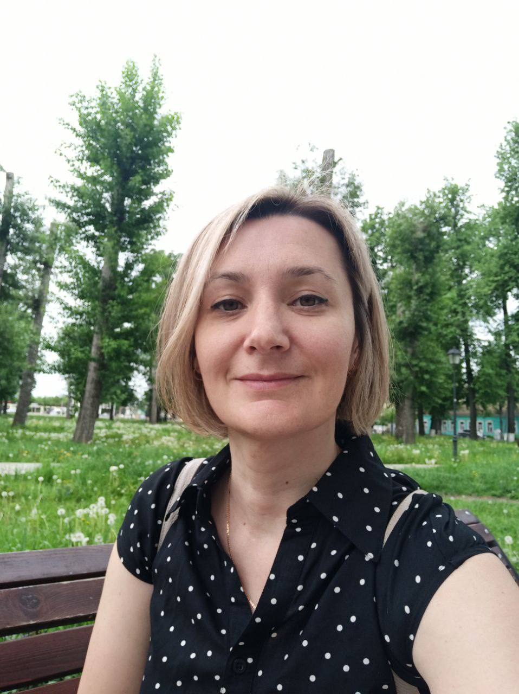

**Привет!**
Меня зовут _Зоя._ 
У меня есть высшее образование, я филолог (учитель русского языка и литературы). 

Мой супруг программист, мне тоже стало интересно учиться в этом направлении и поэтому

**я пришла в Нетологию!** 

# Очень нравится верстка.
## Сложновато с _программированием_, но я стараюсь разобраться. 
### Сейчас осваиваю Git и GitHub.
